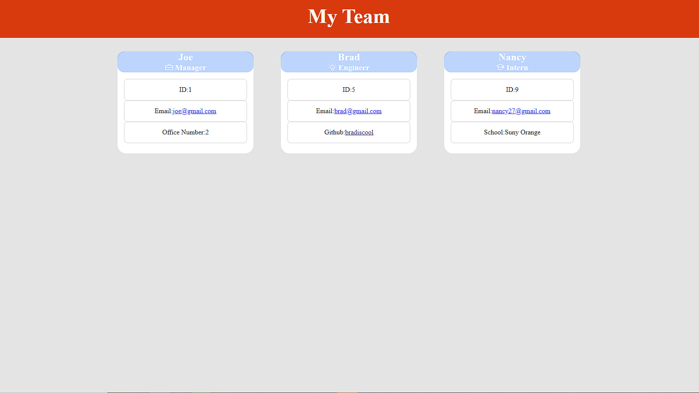

# Team-Builder-Generator

## Example Screenshot

## Walkthrough Video

https://www.youtube.com/watch?v=O536xdMf3TQ

## Table Of Contents
  
* [Description](#Description)
  
* [Author](#Author)
  
* [Installation](#Installation)
  
* [Usage](#Usage)
  
* [Credits](#Credits)
  
* [License](#License)
  
* [Technology](#Technology)
  
## Description
  
This project lets you generate a team after a series of questions you answer in your terminal. The team is then represented in an html template that shows off their name, email, etc as a nicely presented card. I tried to give the cards more of a name tag type of look that employers usually have. However you can see the result screenshot above! While you are there why not click the link to see a general walkthrough video on how to use this program
  
## Technology
  
Node.js, javascript, npm inquierer, npm jest, html, css
  
## Author
  
Name: Brandon Diaz
  
Contact email: brandonjustindiaz@yahoo.com
  
GitHub: [1Clide1](https://github.com/1Clide1) 

  
## Installation
  
To run this program all you need to do is clone my repo, then open your ide of choice in this case for me it is vs code, lastly once open just open the index.js file in your integrated terminal and run node index.js for the best expirence!
  
## Usage
  
You would use this app to generate a full team of a Manager, Intern, and Engineer. You get to see a fully layed out customized website that you can view in any browser that shows off your employess with the info you gave the app.
  
## Credits
  
Man this project definetly was tough! I tried to use as much as I could from the readme generator project to help me out with this project, but honestly I want to shoutout the previous recordings we get to rewatch for class because I felt like these were honestly the most helpful. Another really helpful resource was stack overflow to help me find a regex for the numbers and that was really helpful to get since I am still unsure on the methods to create my own. Other than that I did run into an issue on saving my work to a seperate folder. I probably accidentally skipped through a step in that process however I was stumpted on that. I felt like I had the idea down just not the execution. I decided to leave that work in the project because eventually it will click and I can just remake that feature in the future. Overall I am really pleased on how this project turned out. It was a lot of hard work that in my opinion paid off in the long run because now I have this cool app to show off!
  
## License
  
 

  
This project is licensed under the MIT License: To get a better look at [License] visit (https://choosealicense.com/licenses/mit/).
  

      MIT License

      Copyright (c) [2021] [Brandon Diaz]
      
      Permission is hereby granted, free of charge, to any person obtaining a copy
      of this software and associated documentation files (the "Software"), to deal
      in the Software without restriction, including without limitation the rights
      to use, copy, modify, merge, publish, distribute, sublicense, and/or sell
      copies of the Software, and to permit persons to whom the Software is
      furnished to do so, subject to the following conditions:
      
      The above copyright notice and this permission notice shall be included in all
      copies or substantial portions of the Software.
      
      THE SOFTWARE IS PROVIDED "AS IS", WITHOUT WARRANTY OF ANY KIND, EXPRESS OR
      IMPLIED, INCLUDING BUT NOT LIMITED TO THE WARRANTIES OF MERCHANTABILITY,
      FITNESS FOR A PARTICULAR PURPOSE AND NONINFRINGEMENT. IN NO EVENT SHALL THE
      AUTHORS OR COPYRIGHT HOLDERS BE LIABLE FOR ANY CLAIM, DAMAGES OR OTHER
      LIABILITY, WHETHER IN AN ACTION OF CONTRACT, TORT OR OTHERWISE, ARISING FROM,
      OUT OF OR IN CONNECTION WITH THE SOFTWARE OR THE USE OR OTHER DEALINGS IN THE
      SOFTWARE.
   
